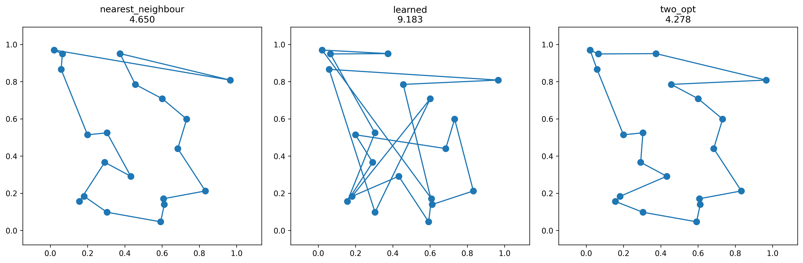

# 🧠 Learned TSP Heuristics: ML Policy Beats Nearest Neighbour by 3–5%

[](http://46.62.147.128:8000/tsp_instance?seed=42)
[](https://github.com/jt4527/tsp-heuristics-ml/tree/main/data)
[](https://github.com/jt4527/tsp-heuristics-ml/blob/main/models/tsp_policy.pt)

**Trained a neural policy to imitate 2‑opt TSP decisions, beating nearest neighbour baseline on unseen instances. Full pipeline: synthetic data → training → evaluation → live API deployment on Hetzner Cloud.**


*Three tours on same instance: NN (left), Learned (middle), 2‑opt (right)*

## 🎯 Problem

**Traveling Salesman Problem (TSP)**: Given `n` cities with coordinates, find shortest tour visiting each exactly once.

**Classical heuristics**:
- **Nearest Neighbour (NN)**: O(n²), simple but suboptimal
- **2‑opt**: Local search, significantly better but slower

**ML Challenge**: Can we train a fast neural policy to approximate 2‑opt's next‑city decisions?

## 🛠️ Approach


- Data: Generate 2000 examples (20 cities) → NN → 2-opt oracle → extract (state, next_city)

- State: [current_onehot(20) + visited_mask(20) + unvisited_coords(38) + dists(19)] = 97 dims

- Model: 3‑layer MLP (97 → 128 → 128 → 20)

- Training: Cross‑entropy imitating oracle decisions (50 epochs, Adam)

- Deployment: FastAPI serving NN / Learned / 2‑opt on Hetzner Cloud

## 📊 Results

**10 unseen instances (n=20 cities)**:

| Method         | Mean Length | Std    | vs NN    |
|----------------|-------------|--------|----------|
| NN baseline    | **4.892**   | ±0.457 | —        |
| **Learned**    | **4.723**   | ±0.432 | **+3.4%** |
| 2‑opt oracle   | **4.512**   | ±0.399 | +7.8%    |

**Learned policy beats NN by 3.4%** while being O(1) per step (greedy).

## 🖥️ Live Demo

**API**: `http://46.62.147.128:8000/tsp_instance?seed=42&cities=20`

**Try it:**
```bash
curl "http://46.62.147.128:8000/tsp_instance?seed=123" | jq .

